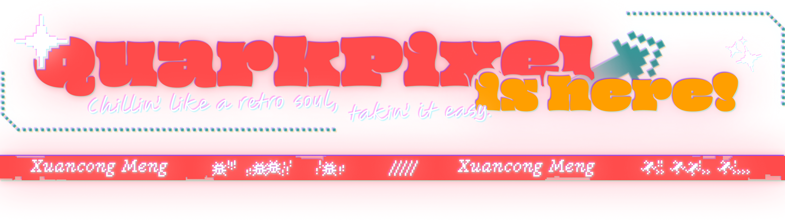
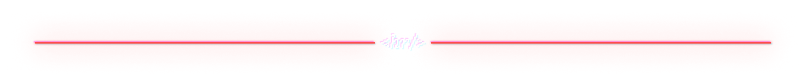

# 🚧🚧 Under Construction 🚧🚧

<picture>
  <source media="(prefers-color-scheme: dark)" srcset="./assets/banner.dark.png">
  <source media="(prefers-color-scheme: light)" srcset="./assets/banner.light.png">
  
</picture>

<picture>
  <source media="(prefers-color-scheme: dark)" srcset="https://readme-typing-svg.demolab.com?font=Micro+5&size=64&duration=3000&pause=100&color=FF4B4B&center=true&vCenter=true&width=1280&height=100&lines=I%27m+Xuancong+Meng;Aka+Hsuan!;A+student.;Stay+hungry.+Stay+foolish.;Exploring+Rust.;This+README+is+compatible+with+both+light+and+dark+modes.;You+are+using+dark+mode+%3A+)">
  <source media="(prefers-color-scheme: light)" srcset="https://readme-typing-svg.demolab.com?font=Micro+5&size=64&duration=3000&pause=100&color=BB2525&center=true&vCenter=true&width=1280&height=100&lines=I%27m+Xuancong+Meng;Aka+Hsuan!;A+student.;Stay+hungry.+Stay+foolish.;Exploring+Rust.;This+README+is+compatible+with+both+dark+and+light+modes.;You+are+using+light+mode+%3A+)">
  
</picture>

<picture>
  <source media="(prefers-color-scheme: dark)" srcset="./assets/divider.dark.png">
  <source media="(prefers-color-scheme: light)" srcset="./assets/divider.light.png">
  
</picture>

### Hi 👋, I'm Xuancong Meng, or just Hsuan.

- 🔭 I’m currently learning through the project [ChunkedVec](https://crates.io/crates/chunked_vec)

- 📫 How to reach me xuancongmeng@gmail.com

<!-- - ⚡ Fun Fact ⚡: I’m super nitpicky about clean code (misaligned braces haunt me) and a hopeless aesthetic nerd for polished, drool-worthy UIs. -->

## 𝗠𝘆 𝗧𝗲𝗰𝗸 𝗦𝘁𝗮𝗰𝗸

### 𝗦𝘁𝗮𝘁𝘀

<picture>
  <source
    srcset="https://github-readme-stats.vercel.app/api/top-langs/?username=quarkpixel&layout=donut&title_color=D1D7E0&bg_color=24293F&border_color=5D6171&text_color=A3AFC1&border_radius=12"
    media="(prefers-color-scheme: dark)"
  />
  <source
    srcset="https://github-readme-stats.vercel.app/api/top-langs/?username=quarkpixel&layout=donut&border_color=E4AAAA&title_color=293E91&border_radius=12"
    media="(prefers-color-scheme: light)"
  />
  
</picture>

<picture>
  <source
    srcset="https://github-readme-stats.vercel.app/api?username=quarkpixel&show_icons=true&title_color=D1D7E0&bg_color=24293F&border_color=5D6171&text_color=FF9F00&icon_color=FF4B4B&border_radius=12"
    media="(prefers-color-scheme: dark)"
  />
  <source
    srcset="https://github-readme-stats.vercel.app/api?username=quarkpixel&show_icons=true&title_color=293E91&bg_color=FFFFFF&border_color=E4AAAA&text_color=6B727B&icon_color=BB2626&border_radius=12"
    media="(prefers-color-scheme: light)"
  />
  
</picture>

<picture>
  <source media="(prefers-color-scheme: dark)" srcset="./assets/footer.dark.png">
  <source media="(prefers-color-scheme: light)" srcset="./assets/footer.light.png">
  
</picture>
